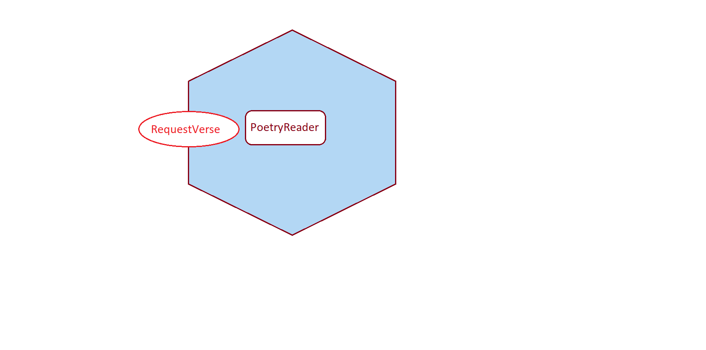
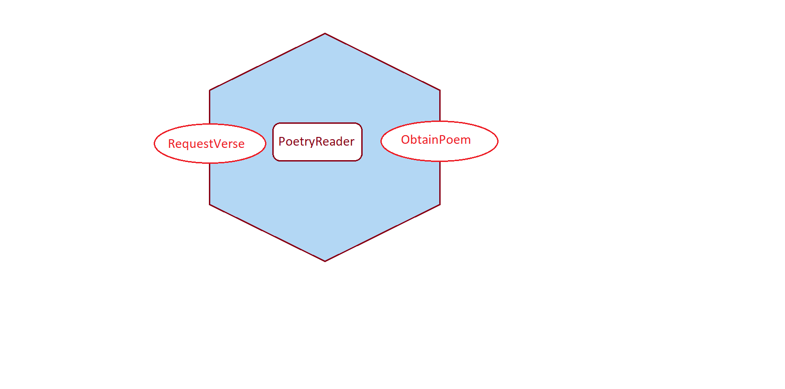
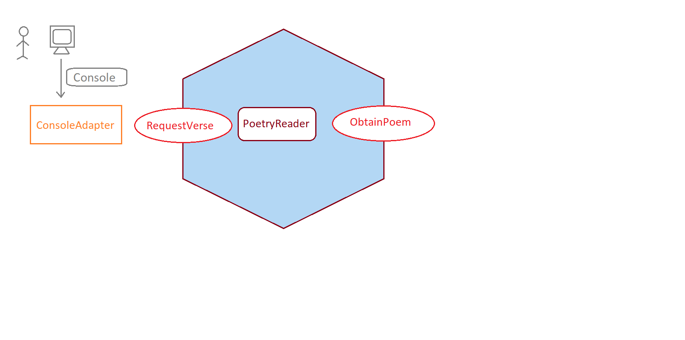
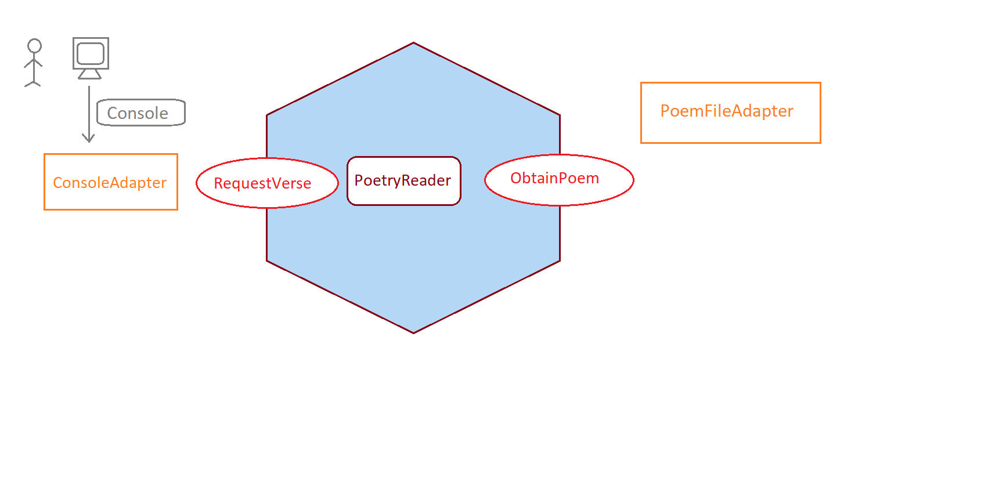

# Poetry Application
This is a KATA application for Hexagonal architecture.

## KATA - 1
- Write the left side port for test for requesting poetry i.e. **`RequestVerse`**.
- Write the domain i.e. **`PoetryReader`** which can be hardcoded. This very first version of the business logic returns a hard-coded result.

## KATA - 2
- Write the right side port **`ObtainPoem`** with adapters i.e. test which fetches the poem using stubs.

## KATA - 3
- Write a **`ConsoleAdapter`**(left side) which could write to the console (default) as the default publication strategy.

## KATA - 4
- Write a **`Console`** application for the end user.

## KATA - 5
- Write a **`PoemFileAdapter`** (right side adapter) that will return the content by reading the file.

## References

### YouTube Videos

- [Alistair in the "Hexagone" 1/3](https://www.youtube.com/watch?v=th4AgBcrEHA)
- [Alistair in the "Hexagone" 2/3](https://www.youtube.com/watch?v=iALcE8BPs94)
- [Alistair in the "Hexagone" 3/3](https://www.youtube.com/watch?v=DAe0Bmcyt-4)

### Spring example

- [spring-hexagonal-example](https://github.com/gshaw-pivotal/spring-hexagonal-example)

### Good reads

- https://softwarecampament.wordpress.com/portsadapters/
- https://beyondxscratch.com/2017/08/19/decoupling-your-technical-code-from-your-business-logic-with-the-hexagonal-architecture-hexarch/